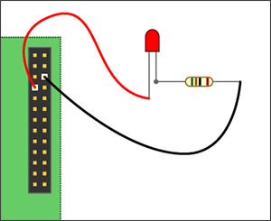

### This folder contains a tutorial for lighting up a led using Raspberry Pi with Python. Lighting up a led is a Hello World program in RPi's GPIO world.

#### All you need:
* a RPi
* a led
* a 50 ohm resistor
* some wire

Your circuit should look like this:

After it is done, add led.py code anywhere in RPi's directory structure e.g.: user home and run the code.
